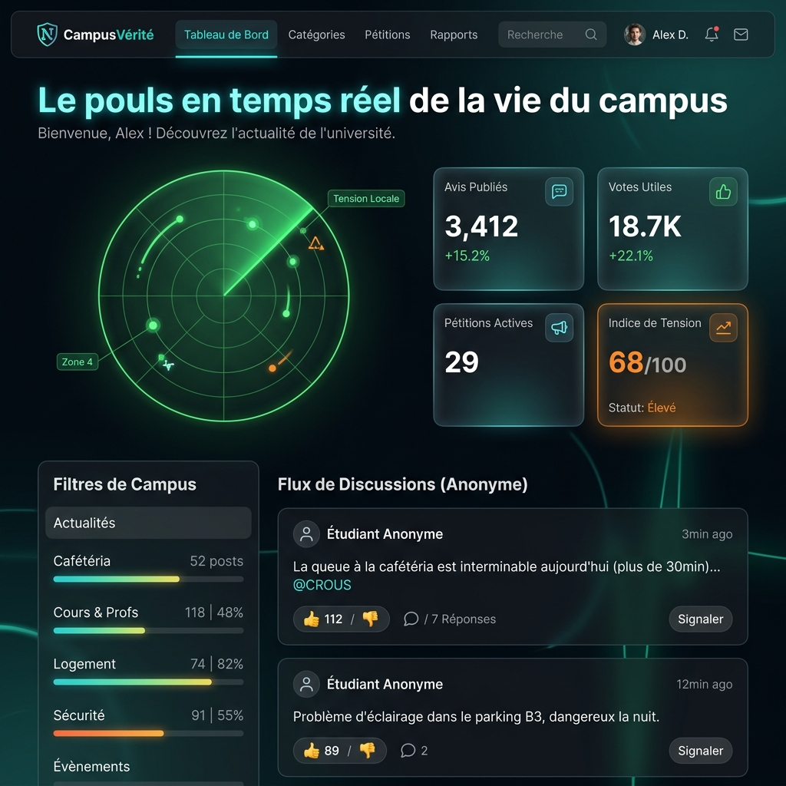
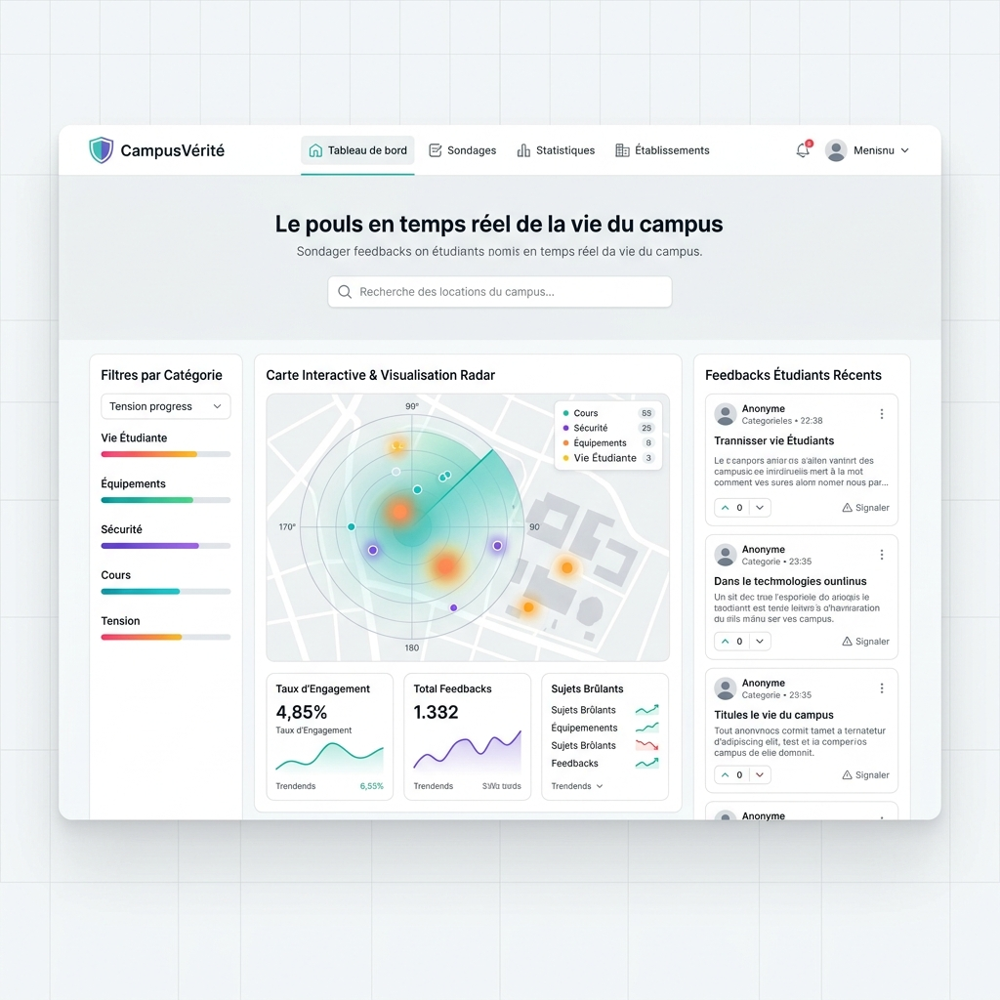
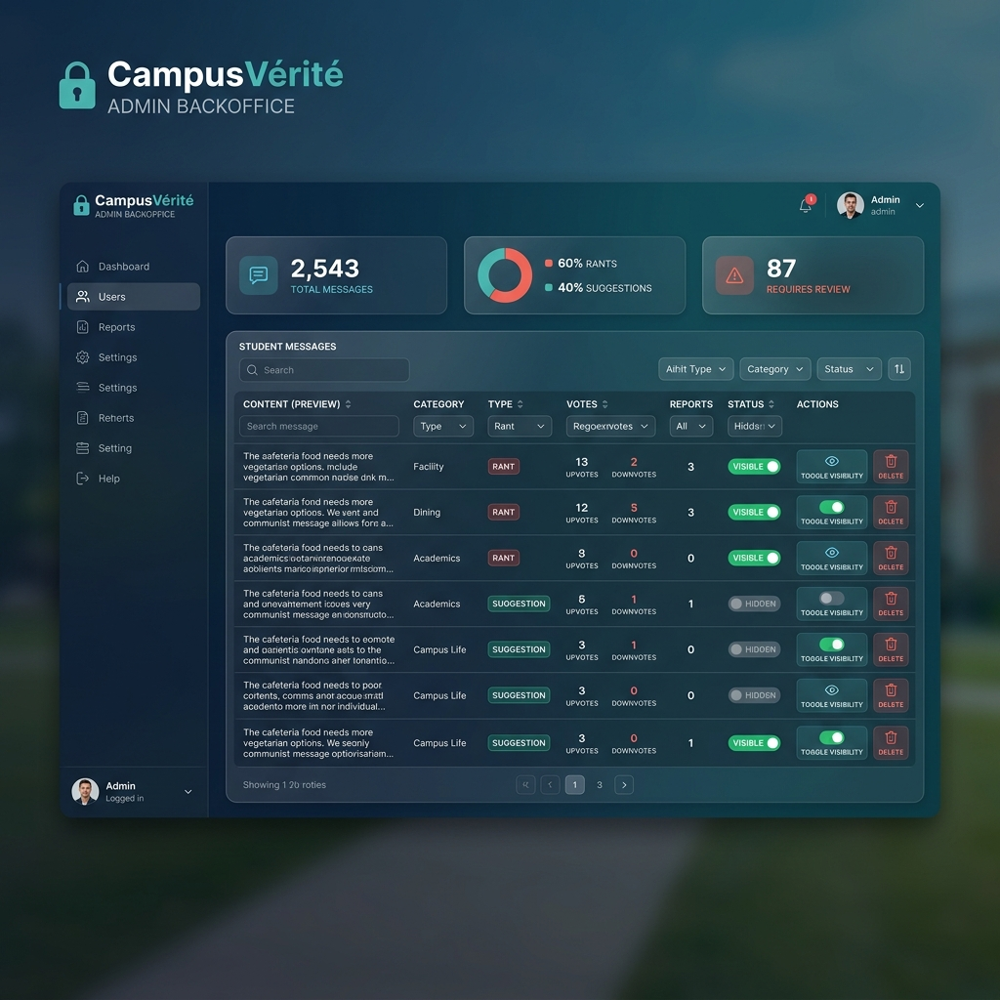

# CampusVérité — Observatoire Étudiant Anonyme 🛡️

**CampusVérité** est une plateforme web moderne et anonyme de feedback étudiant. Elle permet à la communauté d'exprimer librement ses avis, frustrations (coups de gueule) et suggestions concernant la vie sur le campus, sans compte utilisateur et en toute sécurité, afin de favoriser le dialogue avec l'administration.

---

## 📸 Captures d'Écran

### Dashboard — Mode Sombre


### Dashboard — Mode Clair


### Backoffice Administrateur


---

## 🚀 Fonctionnalités Clés

### F1 — 👤 Anonymat par Design
*   **Aucune information personnelle** collectée (ni nom, ni e-mail, ni matricule).
*   Formulaire de publication sans authentification ni suivi d'adresse IP.
*   Protection locale des votes et des signalements dans le navigateur via `localStorage`.

### F2 — 📊 Cockpit Interactif (Wow Factor & Motion Design)
*   **Radar Sonar Canvas HTML5** : Un véritable radar dynamique rotatif avec effet de balayage luminescent, traînée de sonar et points de tension interactifs (blips) survolables pour chaque catégorie.
*   **Mode Sombre & Clair Premium** : Interface double avec transition fluide, persistant dans le stockage local.
*   **Graphique de Distribution (Chart.js)** : Visualisation directe de l'indice de tension de chaque secteur, s'adaptant dynamiquement au thème de couleur.
*   **Animations de Célébration** : Jet de confettis virtuels via `canvas-confetti` lors d'un vote utile ou d'une soumission.
*   **Effet de Cascade** : Chargement progressif et fluide des avis sur le fil d'actualité.

### F3 — 📢 Système de Pétition & Modération Communautaire
*   **Pétition automatique** : Dès qu'un avis réunit 10 votes utiles, il acquiert le badge **Pétition Active** pour attirer l'attention de l'administration.
*   **Signalement d'abus** : Les utilisateurs peuvent signaler un message déplacé. À partir de 5 signalements, l'avis est automatiquement retiré du fil public.

### F4 — 🌡️ Radar de Tension Campus
*   Carte de chaleur par catégorie (Cours & Profs, Administration, Équipements, etc.).
*   Indice de tension calculé dynamiquement à partir des votes, publications et signalements.
*   Barres de progression interactives par secteur.

### F5 — 📝 Formulaire de Soumission Anonyme
*   Formulaire riche avec validation serveur et retour visuel des erreurs.
*   Sélection de catégorie et type de signal (Coup de Gueule ou Suggestion).
*   Aucun compte nécessaire — publication en un clic.

### F6 — 🔑 Backoffice d'Administration & Modération (Super Bonus 🌟)
*   **Zone d'administration sécurisée** accessible sur `/admin/login` (configurable via variable d'environnement).
*   **Modération en temps réel (AJAX)** :
    *   Possibilité de **masquer/restaurer** n'importe quel signal d'un clic.
    *   **Suppression définitive** des messages inappropriés directement de la base SQLite.
*   **Statistiques complètes** : Nombre total de messages, répartition rants/suggestions, et volume de signalements.

---

## 🛠️ Stack Technique

| Composant | Technologie |
|---|---|
| **Backend** | Python 3, Flask, SQLite3, WSGI |
| **Frontend** | HTML5 sémantique, CSS3 (variables, transitions, grid/flexbox), JS Vanilla (Canvas API, Fetch API) |
| **Serveur Prod** | Gunicorn |
| **Bibliothèques** | Lucide Icons, Chart.js, Canvas-Confetti, Python-Dotenv |
| **Conteneurisation** | Docker, Docker Compose |

---

## 📁 Structure du Projet

```text
app.py                  # Point d'entrée de développement
wsgi.py                 # Point d'entrée pour le serveur WSGI de production
gunicorn.conf.py        # Configuration optimisée de production Gunicorn
Dockerfile              # Build multi-stage optimisé et sécurisé (non-root)
docker-compose.yml      # Orchestration multi-conteneurs avec volume SQLite
Procfile                # Déploiement cloud (Render, Heroku, Railway)
requirements.txt        # Dépendances Python du projet
.env.example            # Fichier de variables d'environnement d'exemple
campusverite/           # Module principal de l'application Flask
  __init__.py           # Initialisation, en-têtes de sécurité HTTP & sessions
  config.py             # Gestion des configurations & chargement de dotenv
  constants.py          # Constantes de l'application (catégories, types)
  db.py                 # Initialisation de la base de données SQLite
  filters.py            # Filtres Jinja2 (temps relatif, labels de publication)
  routes.py             # Contrôleurs web et API (routes utilisateurs et admin)
  services.py           # Opérations de base de données (SQL)
  templates/            # Modèles HTML Jinja2 (base, index, submit, admin)
  static/               # Assets statiques (style.css, app.js)
scripts/
  smoke_test.py         # Script automatisé de tests de fumée
docs/
  conception-campusverite.md  # Document de conception
  screenshots/          # Captures d'écran de l'application
```

---

## 💻 Démarrage Local

### 1. Prérequis
Assurez-vous d'avoir **Python 3.10+** installé sur votre machine.

### 2. Installation & Lancement

```bash
# Cloner le dépôt
git clone https://github.com/VOTRE-USERNAME/campusverite.git
cd campusverite

# Créer et activer l'environnement virtuel
python3 -m venv .venv
source .venv/bin/activate

# Installer les dépendances
pip install -r requirements.txt

# (Optionnel) Configurer les variables d'environnement
cp .env.example .env
# Éditez .env selon vos besoins

# Lancer l'application en développement
python app.py
```

Ouvrez ensuite votre navigateur à l'adresse : **[http://127.0.0.1:5000](http://127.0.0.1:5000)**

---

## 🐳 Déploiement Production (Docker & Compose)

Pour déployer l'application de manière isolée et sécurisée en production :

### Lancer via Docker Compose (Recommandé)
```bash
docker compose up --build -d
```
L'application démarre sur le port `5000` et la base de données est automatiquement stockée dans un volume persistant (`campusverite_data`).

### Déploiement Cloud (Render, Railway, etc.)
Le projet inclut un `Procfile` et un `Dockerfile` prêts pour le déploiement sur les plateformes cloud gratuites :
```bash
# Procfile pour Render / Railway / Heroku
web: gunicorn wsgi:app
```

---

## 🔑 Accès Backoffice Administrateur

| Champ | Valeur |
|---|---|
| **URL** | `/admin/login` |
| **Identifiant** | `admin` |
| **Mot de passe** | `admin123` *(modifiable via `.env`)* |

---

## 🧪 Tests de Validation

Pour exécuter la suite de tests automatisés (vérifiant le fil public, la publication, le système de votes et de signalements, la connexion admin et la modération des messages) :

```bash
PYTHONPATH=. python3 scripts/smoke_test.py
```
*Sortie attendue : `Smoke test CampusVerite OK`*

---

## 📜 Licence

Projet réalisé dans le cadre d'une compétition de Vibe Coding.

---

<p align="center">
  <strong>CampusVérité</strong> — Parce que seule la vérité compte. 🛡️
</p>
