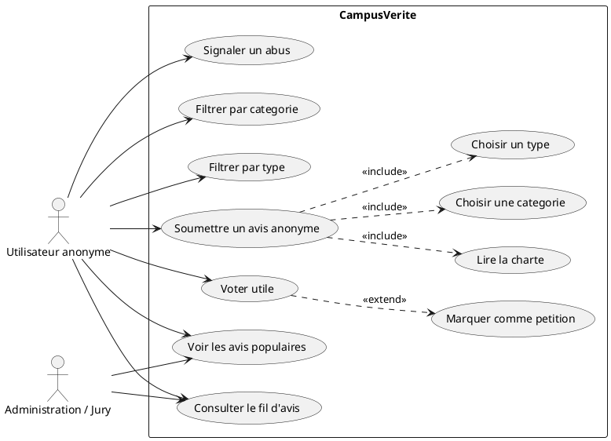
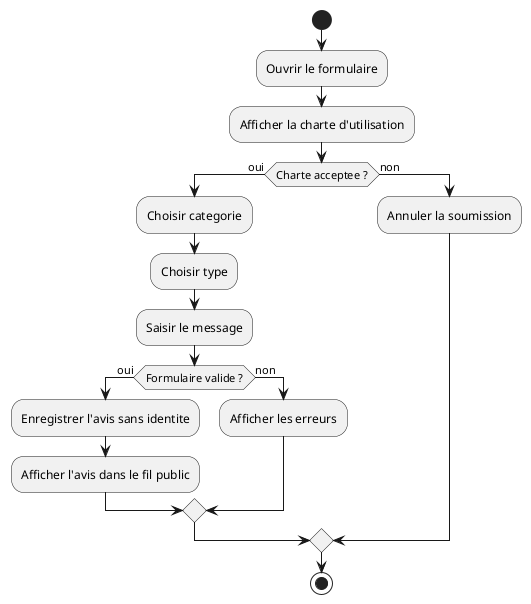
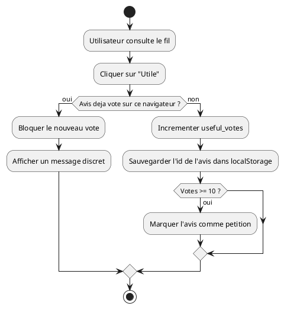
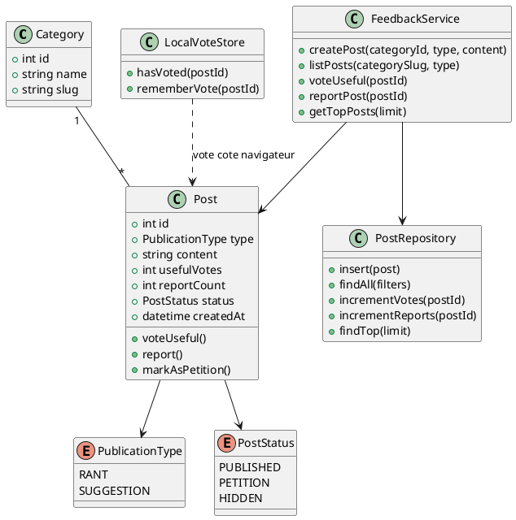
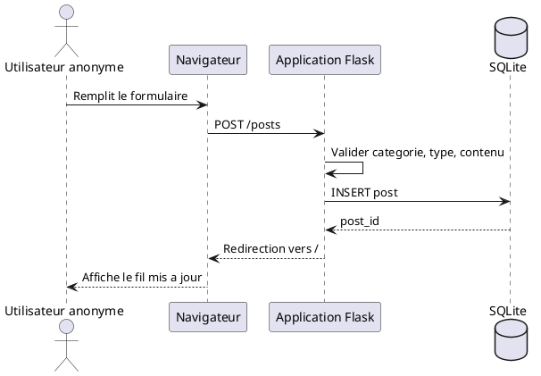
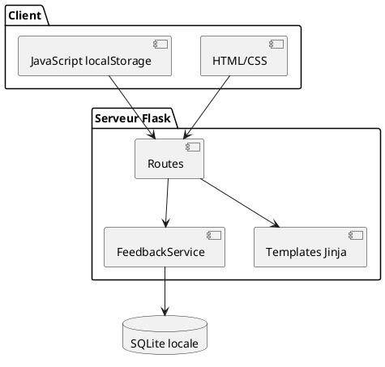

# CampusVerite - Note de conception

Cette note resume le cahier des charges du projet CampusVerite et propose une conception realiste pour un sprint de 2 heures.

> Important : le cahier des charges interdit l'utilisation de l'IA pendant la competition. Ce document doit servir de preparation et de comprehension avant l'epreuve, pas de livrable genere pendant l'epreuve.

## Lecture du besoin

CampusVerite est une plateforme web anonyme ou les etudiants publient des avis sur la vie de l'ecole. Le point central n'est pas seulement le formulaire : c'est la confiance. L'application doit donc eviter tout champ identifiant, rester simple, lisible, et rendre les problemes visibles.

Fonctionnalites obligatoires :

- Soumettre un avis sans nom, prenom, email ou compte.
- Choisir une categorie : Pedagogie, Infrastructure, Administration, Equipements.
- Choisir un type : Coup de Gueule ou Suggestion.
- Afficher un fil public du plus recent au plus ancien.
- Voter "Utile" sans connexion.
- Filtrer par categorie et par type.

Bonus interessants :

- Top 3 ou Top 5 des avis les plus votes.
- Marquage "petition" a partir d'un seuil de votes.
- Radar Campus avec indice de tension par categorie.
- Charte d'utilisation avant publication.
- Signalement d'abus.
- Interface responsive.

## Avis sur le projet

Le sujet est bien adapte a une competition courte : les fonctionnalites sont claires, utiles, et la valeur est visible rapidement. Le piege principal est de vouloir ajouter trop de choses. Pour gagner des points, il vaut mieux livrer un coeur solide : formulaire, stockage, affichage, votes, filtres, README propre, puis seulement ajouter 2 ou 3 bonus simples.

La difficulte technique la plus sensible est le vote sans connexion. Sans compte et sans collecte d'identite, on ne peut pas garantir parfaitement "un visiteur = un vote". Pour respecter l'anonymat, le meilleur compromis de sprint est :

- cote serveur : stocker seulement le nombre de votes ;
- cote navigateur : utiliser `localStorage` pour retenir les avis deja votes sur ce navigateur ;
- ne jamais stocker nom, email, matricule ou IP dans l'interface ou dans la base.

## Stack recommandee

Stack principale recommandee :

- Backend : Python Flask.
- Base de donnees : SQLite locale.
- Frontend : HTML Jinja, CSS simple, JavaScript vanilla.
- Lancement : `flask --app app run` ou `python app.py`.

Pourquoi cette stack :

- rapide a developper en 2 heures ;
- pas de build frontend ;
- base locale facile a versionner ou initialiser ;
- routes tres lisibles pour le jury ;
- README simple ;
- possible a deployer ensuite sur Render/Railway si besoin.

Alternative si tu es plus a l'aise en PHP :

- PHP 8 + SQLite + HTML/CSS/JS vanilla.

## Architecture proposee

Pages principales :

- `/` : fil public, filtres, top avis, formulaire ou lien vers formulaire.
- `/submit` : formulaire de soumission anonyme.
- `/posts` en `POST` : creation d'un avis.
- `/posts/<id>/vote` en `POST` : vote utile.
- `/posts/<id>/report` en `POST` : signalement d'abus.

Structure de projet possible :

```text
campusverite/
  app.py
  schema.sql
  campusverite.db
  templates/
    base.html
    index.html
    submit.html
  static/
    css/style.css
    js/app.js
  README.md
```

## Modele de donnees

Tables minimales :

- `categories(id, name, slug)`
- `posts(id, category_id, type, content, useful_votes, report_count, status, created_at)`

Valeurs utiles :

- `type` : `rant` pour Coup de Gueule, `suggestion` pour Suggestion.
- `status` : `published`, `petition`, `hidden`.
- seuil petition : 10 votes utiles.

## Diagramme de cas d'utilisation



## Diagramme d'activite - Soumission d'un avis



## Diagramme d'activite - Vote utile



## Diagramme de classes



## Diagramme de sequence - Creation d'un avis



## Diagramme de composants



## Plan de realisation en 2 heures

- 0-15 min : initialiser projet, README, structure, base SQLite.
- 15-40 min : formulaire anonyme et insertion des avis.
- 40-60 min : fil public trie par date.
- 60-75 min : categories, types et filtres.
- 75-90 min : vote utile avec compteur et `localStorage`.
- 90-105 min : bonus simples : top avis, badge petition, responsive.
- 105-120 min : correction UI, captures si possible, README et push GitHub.

## Priorite de developpement

Ordre conseille :

1. Faire fonctionner le stockage et le fil public.
2. Ajouter formulaire avec validation.
3. Ajouter filtres.
4. Ajouter votes.
5. Soigner l'interface.
6. Ajouter bonus seulement si le coeur est stable.

Pour la presentation devant le jury, il faut insister sur trois idees : anonymat respecte, utilite sociale du canal de feedback, et visibilite des problemes les plus importants.

Innovation conseillee : presenter le Radar Campus comme un tableau de bord decisionnel. Il transforme les avis anonymes en priorites d'action sans identifier les auteurs.
